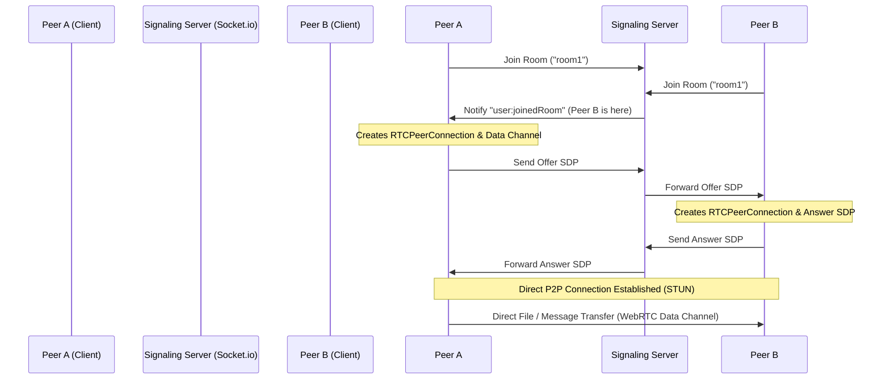

# P2P-Share: Real-Time WebRTC File Transfer & Messaging

A high-performance, real-time peer-to-peer (P2P) file sharing and messaging web application built using **React, Vite, Node.js, Express, Socket.io**, and **WebRTC Data Channels**. 

This application allows users to connect securely via temporary rooms, send instant messages, and transfer large files directly between browsers (bypassing any intermediary cloud servers) with real-time transfer stats.

---

## 🚀 Key Technical Highlights 

If you are showcasing this project on your resume or in interviews, highlight these technical challenges you solved:

1. **WebRTC Data Channel Backpressure Management:**
   - Designed a file chunking mechanism (slicing files into `16 KB` blocks) for sending large files over `RTCDataChannel`.
   - Prevented browser tab memory exhaustion and connection drops by actively monitoring `bufferedAmount` (holding queue execution when buffer threshold exceeds `64 KB`).

2. **ICE Candidate Synchronization & Race-Condition Prevention:**
   - Solved a common WebRTC race condition where network ICE candidates arrive before the session description protocol (SDP) answer is set.
   - Built an asynchronous ICE candidate queuing system that buffer-stores early candidates and processes them sequentially once `setRemoteDescription` completes.

3. **Dynamic Network Performance & Speed Metrics:**
   - Implemented real-time upload speed calculation (in MBps/KBps) and dynamic Estimated Time of Arrival (ETA) calculation.
   - Built abort signals (`AbortController`) to handle user-initiated cancellations.

4. **Connection Lifecycle Synchronization:**
   - Synchronized signaling states using Socket.io to broadcast room exits (`user:leftRoom`).
   - Enabled client-side garbage collection and connection re-initialization upon peer disconnection.

---

## 🛠️ System Architecture



---

## ⚙️ Project Configuration & Deployment

### Environment Variables

#### Frontend Configuration (`/.env`)
Create a `.env` file in the root directory:
```env
VITE_SIGNALING_SERVER_URL=https://your-deployed-backend-url.com
```
*Note: For local development, this defaults to `http://localhost:5000`.*

#### Backend Configuration (`/server/.env`)
Create a `.env` file in the `server` directory:
```env
PORT=5000
```

---

## 📦 Deployment Guide

### Option 1: Multi-Host Deployment (Recommended)
This approach deploys the frontend and backend separately:
- **Frontend:** Deploy to static hosts like **Vercel**, **Netlify**, or **GitHub Pages**. Ensure you configure `VITE_SIGNALING_SERVER_URL` in the provider's environment variables pointing to your backend.
- **Backend (Signaling Server):** Deploy to backend environments like **Render**, **Railway**, **Fly.io**, or **AWS ECS/EC2**. The server will automatically use the dynamic port assigned by the provider.

### Option 2: Single-Host Deployment (Unified Server)
To deploy the client and server together:
1. Build the production assets of the client:
   ```bash
   npm run build
   ```
2. Modify `server/index.js` to serve the static build folder:
   ```javascript
   import path from "path";
   const __dirname = path.resolve();
   app.use(express.static(path.join(__dirname, "../dist")));
   app.get("*", (req, res) => {
     res.sendFile(path.join(__dirname, "../dist/index.html"));
   });
   ```
3. Deploy the entire directory to a single backend platform (e.g., Render, Railway).
